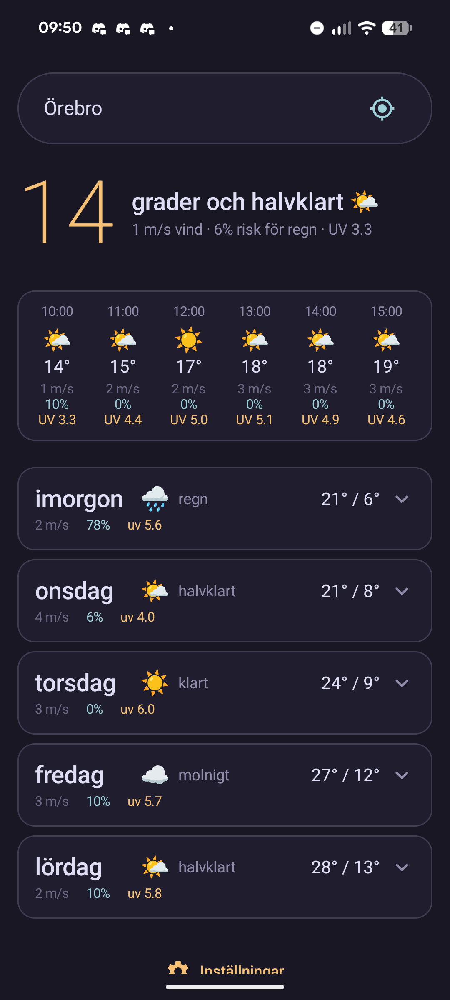
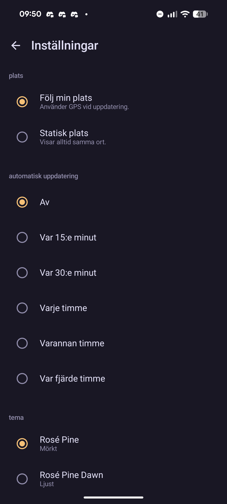

# vedret


Native Android client for [vedret.se](https://vedret.se) — consensus weather for **Swedish locations** 🇸🇪. Instead of trusting one forecast, vedret asks SMHI, YR, Open-Meteo (plus ECMWF, DWD ICON and DMI models), OpenWeather, WeatherAPI and Pirate Weather about the same place and shows you what they agree on.

> 🇸🇪 **Sweden only.** Forecasts cover Swedish locations, and the app speaks Swedish — precis som det ska vara.

<p>
  
  
</p>

## Features

- Current weather, hour-by-hour scrollable forecast, and a 5-day expandable outlook
- Rain that never hides: the day flips to 🌧️ when the sources agree rain is coming, even if the dry hours outnumber the wet ones
- Two home-screen widgets (current + upcoming hours), Glance-based
- Location by GPS, city search with autocomplete, or IP fallback
- Light/dark theme following the system

## Building

```bash
./gradlew assembleDebug
```

Release builds are signed in CI; locally the release build falls back to the debug keystore.

## License

[GPL-3.0](LICENSE)
